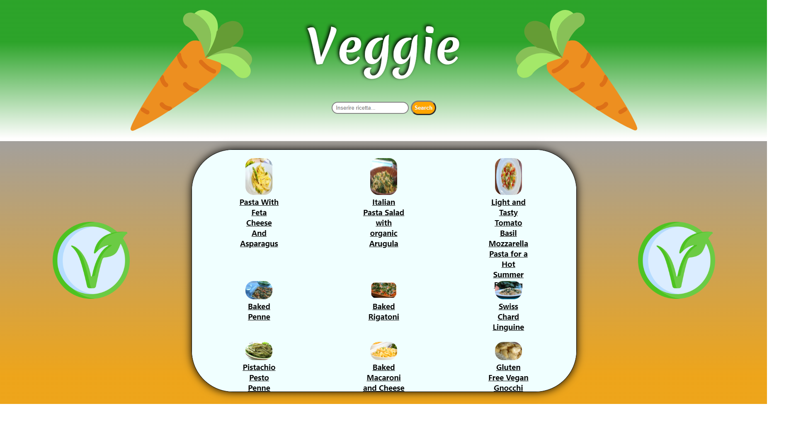

# Veggie

<!-- PROJECT LOGO -->
 

  

<!-- TABLE OF CONTENTS -->

  
Table of Contents

  <ol>
    <li>
      <a href="#about-the-project">About The Project</a>
      <ul>
        <li><a href="#built-with">Built With</a></li>
      </ul>
    </li>
    <li><a href="#usage">Usage</a></li>
    <li><a href="#project-link">Project Link</a></li>
    <li><a href="#contact">Contact</a></li>
  </ol>

<!-- ABOUT THE PROJECT -->
## About The Project

</img>

Veggie è una single page app che permette di cercare ricette esclusivamente vegetariane, contattando le API del servizio Spoonacular.

### Built With

* HTML
* CSS
* JavaScript
* React

<!-- USAGE EXAMPLES -->
## Usage

Veggie è composta da una Homepage ed una pagina dedicata ai dettagli di ogni ricetta. E' facilmente fruibile utilizzando la textbox ed il pulsante di ricerca.

## Project Link

A questo link è possibile provare l'applicazione: [https://veggie-2.web.app/](https://veggie-2.web.app/)

<!-- CONTACT -->
## Contact

Mario Malitesta - mario.malitesta@gmail.com

(<a href="#top">back to top</a>)

